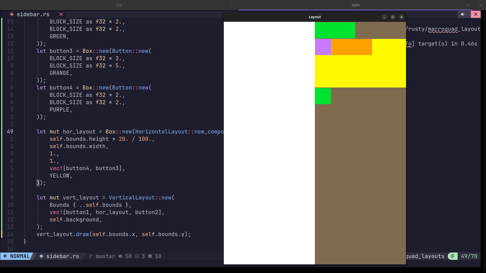

# macroquad_layouts

A learning project. My main goal is to get better at writing Rust, using
this as an excuse to figure out how to build nestable UI layouts on top of
[macroquad](https://github.com/not-fl3/macroquad).

The idea: a small library where components (buttons, layouts, etc.) can be
nested inside each other, similar to how layouts work in Flutter/web CSS.



## Status

MVP stage. Currently working:
- Layouts creation.
- Layouts can nest other layouts.
- `HorizontalLayout` and `VerticalLayout` containers that can nest components
- `HorizontalLayout` and `VerticalLayout`  kind of truncate components that cannot fit in the layout. 
This behaviour could stick, wrapping could be added as part of a different layout, or i could just say fuck it 
and modify them to at least try wrapping before truncating. 

- A test `Button` component

Buttons don't react to events yet — that's next.

## Running

```
cargo run
```
